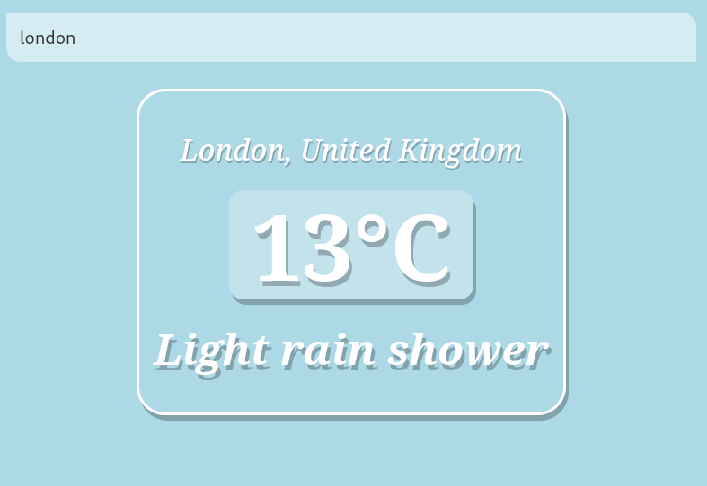

# Weather App

Uma aplicação em Vue 3 com composition API que permite a busca de uma cidade pelo nome e mostra algumas informações do tempo na cidade encontrada.



#### Tecnologias
---

- [Vue 3](https://vuejs.org/)
- [Weather API](https://www.weatherapi.com/)

#### Configuração do projeto
---

```sh
# clona .env -> .env.local
# Adicionar a sua API_KEY da www.weatherapi.com no arquivo .env.local
cp .env .env.local

# Instala as dependências do projeto
npm install

# Executa o projeto
npm run dev
```
